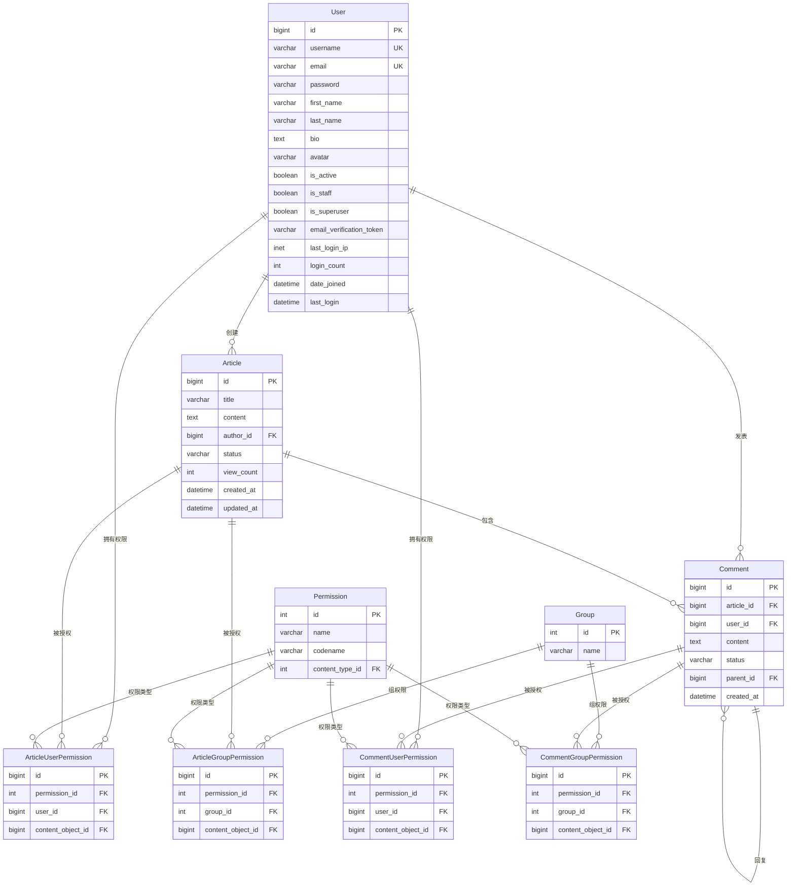

# Django博客平台数据库设计文档

## 1. 数据库概述

### 1.1 设计原则

本博客平台数据库设计遵循以下原则：

- **规范化设计**：遵循第三范式，减少数据冗余
- **性能优化**：合理设置索引，优化查询性能
- **扩展性**：预留扩展空间，支持未来功能增加
- **安全性**：实现细粒度权限控制，保护数据安全
- **一致性**：使用外键约束保证数据完整性

### 1.2 技术栈

- **数据库引擎**：MySQL 8.0+
- **ORM框架**：Django ORM
- **权限管理**：Django Guardian (对象级权限)
- **缓存策略**：Redis (用于性能优化)

## 2. 数据表详细设计

### 2.1 用户表 (users_user)

**表说明**：扩展Django默认用户模型，存储用户基本信息和博客相关属性

| 字段名 | 数据类型 | 长度 | 约束 | 默认值 | 说明 |
|--------|----------|------|------|--------|------|
| id | BigAutoField | - | PK, AUTO_INCREMENT | - | 主键 |
| username | CharField | 150 | UNIQUE, NOT NULL | - | 用户名 |
| email | EmailField | 254 | UNIQUE, NOT NULL | - | 邮箱地址(登录用) |
| password | CharField | 128 | NOT NULL | - | 加密密码 |
| first_name | CharField | 150 | - | '' | 名字 |
| last_name | CharField | 150 | - | '' | 姓氏 |
| bio | TextField | 500 | - | '' | 个人简介 |
| avatar | ImageField | 100 | - | '' | 头像文件路径 |
| is_active | BooleanField | - | NOT NULL | False | 账户激活状态 |
| is_staff | BooleanField | - | NOT NULL | False | 管理员状态 |
| is_superuser | BooleanField | - | NOT NULL | False | 超级用户状态 |
| email_verification_token | CharField | 64 | - | '' | 邮箱验证令牌 |
| last_login_ip | GenericIPAddressField | - | NULL | NULL | 最后登录IP |
| login_count | PositiveIntegerField | - | NOT NULL | 0 | 登录次数统计 |
| date_joined | DateTimeField | - | NOT NULL | NOW() | 注册时间 |
| last_login | DateTimeField | - | NULL | NULL | 最后登录时间 |

**索引设计**：

- PRIMARY KEY (id)
- UNIQUE KEY (username)
- UNIQUE KEY (email)
- INDEX (is_active)
- INDEX (date_joined)

### 2.2 文章表 (articles_article)

**表说明**：存储博客文章的核心信息

| 字段名 | 数据类型 | 长度 | 约束 | 默认值 | 说明 |
|--------|----------|------|------|--------|------|
| id | BigAutoField | - | PK, AUTO_INCREMENT | - | 主键 |
| title | CharField | 255 | NOT NULL | - | 文章标题 |
| content | TextField | - | NOT NULL | - | 文章内容 |
| author_id | BigIntegerField | - | FK, NOT NULL | - | 作者ID(外键) |
| status | CharField | 10 | NOT NULL | 'draft' | 发布状态 |
| view_count | PositiveIntegerField | - | NOT NULL | 0 | 访问次数 |
| created_at | DateTimeField | - | NOT NULL | NOW() | 创建时间 |
| updated_at | DateTimeField | - | NOT NULL | NOW() | 更新时间 |

**枚举值**：

- status: 'draft'(草稿), 'published'(已发布)

**外键关系**：

- author_id → users_user.id (CASCADE)

**索引设计**：

- PRIMARY KEY (id)
- INDEX (created_at DESC) - 按时间排序
- INDEX (status, created_at DESC) - 状态+时间组合
- INDEX (author_id, status) - 作者+状态组合
- INDEX (view_count DESC) - 按访问量排序
- INDEX (title) - 标题搜索
- FOREIGN KEY (author_id)

### 2.3 评论表 (comments_comment)

**表说明**：存储文章评论，支持嵌套回复

| 字段名 | 数据类型 | 长度 | 约束 | 默认值 | 说明 |
|--------|----------|------|------|--------|------|
| id | BigAutoField | - | PK, AUTO_INCREMENT | - | 主键 |
| article_id | BigIntegerField | - | FK, NOT NULL | - | 文章ID(外键) |
| user_id | BigIntegerField | - | FK, NOT NULL | - | 用户ID(外键) |
| content | TextField | - | NOT NULL | - | 评论内容 |
| status | CharField | 10 | NOT NULL | 'pending' | 审核状态 |
| parent_id | BigIntegerField | - | FK, NULL | NULL | 父评论ID(外键) |
| created_at | DateTimeField | - | NOT NULL | NOW() | 创建时间 |

**枚举值**：

- status: 'pending'(待审核), 'approved'(已通过), 'rejected'(已拒绝)

**外键关系**：

- article_id → articles_article.id (CASCADE)
- user_id → users_user.id (CASCADE)
- parent_id → comments_comment.id (CASCADE)

**索引设计**：

- PRIMARY KEY (id)
- INDEX (parent_id, created_at) - 排序索引
- INDEX (article_id, status) - 文章评论查询
- INDEX (user_id) - 用户评论查询
- INDEX (status) - 审核状态查询
- FOREIGN KEY (article_id)
- FOREIGN KEY (user_id)
- FOREIGN KEY (parent_id)

## 3. 权限控制表

### 3.1 文章用户权限表 (articles_articleuserobjectpermission)

**表说明**：存储用户对特定文章的权限

| 字段名 | 数据类型 | 长度 | 约束 | 默认值 | 说明 |
|--------|----------|------|------|--------|------|
| id | BigAutoField | - | PK, AUTO_INCREMENT | - | 主键 |
| permission_id | IntegerField | - | FK, NOT NULL | - | 权限ID |
| user_id | BigIntegerField | - | FK, NOT NULL | - | 用户ID |
| content_object_id | BigIntegerField | - | FK, NOT NULL | - | 文章ID |

### 3.2 文章组权限表 (articles_articlegroupobjectpermission)

**表说明**：存储用户组对特定文章的权限

| 字段名 | 数据类型 | 长度 | 约束 | 默认值 | 说明 |
|--------|----------|------|------|--------|------|
| id | BigAutoField | - | PK, AUTO_INCREMENT | - | 主键 |
| permission_id | IntegerField | - | FK, NOT NULL | - | 权限ID |
| group_id | IntegerField | - | FK, NOT NULL | - | 用户组ID |
| content_object_id | BigIntegerField | - | FK, NOT NULL | - | 文章ID |

### 3.3 评论权限表

评论权限表结构与文章权限表类似，包括：

- comments_commentuserobjectpermission
- comments_commentgroupobjectpermission

## 4. 表关系说明

### 4.1 一对多关系

1. **用户 → 文章**：一个用户可以创建多篇文章
   - users_user.id ← articles_article.author_id

2. **用户 → 评论**：一个用户可以发表多条评论
   - users_user.id ← comments_comment.user_id

3. **文章 → 评论**：一篇文章可以有多条评论
   - articles_article.id ← comments_comment.article_id

4. **评论 → 回复**：一条评论可以有多条回复(自关联)
   - comments_comment.id ← comments_comment.parent_id

### 4.2 多对多关系

通过权限表实现的多对多关系：

1. **用户 ↔ 文章权限**：用户可以对多篇文章有不同权限
2. **用户组 ↔ 文章权限**：用户组可以对多篇文章有不同权限
3. **用户 ↔ 评论权限**：用户可以对多条评论有不同权限

## 5. 数据完整性约束

### 5.1 外键约束

- **级联删除**：当用户被删除时，其创建的文章和评论也会被删除
- **级联删除**：当文章被删除时，相关的评论也会被删除
- **级联删除**：当父评论被删除时，其回复也会被删除

### 5.2 唯一性约束

- 用户名(username)必须唯一
- 邮箱地址(email)必须唯一

### 5.3 非空约束

- 关键字段如标题、内容、用户名、邮箱等不能为空
- 时间戳字段自动设置，不能为空

### 5.4 检查约束

- 邮箱格式验证
- 状态字段枚举值验证
- 正整数字段(如访问次数、登录次数)非负验证

## 6. 索引策略

### 6.1 主键索引

所有表都有自增主键，自动创建聚簇索引。

### 6.2 唯一索引

- users_user: username, email
- 权限表: (user_id, permission_id, content_object_id) 组合唯一

### 6.3 普通索引

**文章表索引**：

- 时间排序: (created_at DESC)
- 状态查询: (status, created_at DESC)
- 作者查询: (author_id, status)
- 热门排序: (view_count DESC)
- 搜索优化: (title)

**评论表索引**：

- 评论排序: (parent_id, created_at)
- 文章评论: (article_id, status)
- 用户评论: (user_id)
- 审核查询: (status)

**用户表索引**：

- 激活状态: (is_active)
- 注册时间: (date_joined)

### 6.4 复合索引设计原则

1. **最左前缀原则**：将选择性高的字段放在前面
2. **查询覆盖**：尽量让索引覆盖常用查询
3. **排序优化**：为ORDER BY子句创建对应索引

## 7. 性能优化建议

### 7.1 查询优化

1. **分页查询**：使用LIMIT和OFFSET进行分页
2. **预加载**：使用select_related和prefetch_related减少查询次数
3. **缓存策略**：对热点数据使用Redis缓存

### 7.2 写入优化

1. **批量操作**：使用bulk_create和bulk_update
2. **事务控制**：合理使用数据库事务
3. **异步处理**：对非关键操作使用异步任务

### 7.3 存储优化

1. **文件存储**：头像等文件使用对象存储服务
2. **数据归档**：定期归档历史数据
3. **分区策略**：对大表考虑分区存储

## 8. 安全性设计

### 8.1 权限控制

1. **对象级权限**：使用Django Guardian实现细粒度权限控制
2. **权限继承**：合理设计权限继承关系
3. **权限缓存**：缓存权限查询结果提高性能

### 8.2 数据保护

1. **密码加密**：使用Django内置的密码哈希
2. **SQL注入防护**：使用ORM参数化查询
3. **XSS防护**：对用户输入进行转义处理

### 8.3 审计日志

1. **操作记录**：记录关键操作的审计日志
2. **登录日志**：记录用户登录信息和IP地址
3. **数据变更**：跟踪重要数据的变更历史

## 9. 实体关系图 (ER图)

### 9.1 核心实体关系图



### 9.2 关系说明

#### 9.2.1 核心业务关系

1. **用户-文章关系 (1:N)**
   - 一个用户可以创建多篇文章
   - 每篇文章只能有一个作者
   - 关系字段：Article.author_id → User.id

2. **用户-评论关系 (1:N)**
   - 一个用户可以发表多条评论
   - 每条评论只能有一个作者
   - 关系字段：Comment.user_id → User.id

3. **文章-评论关系 (1:N)**
   - 一篇文章可以有多条评论
   - 每条评论只能属于一篇文章
   - 关系字段：Comment.article_id → Article.id

4. **评论-回复关系 (1:N 自关联)**
   - 一条评论可以有多条回复
   - 每条回复只能回复一条评论
   - 关系字段：Comment.parent_id → Comment.id

#### 9.2.2 权限控制关系

1. **用户-文章权限关系 (M:N)**
   - 通过ArticleUserPermission中间表实现
   - 一个用户可以对多篇文章有不同权限
   - 一篇文章可以授权给多个用户

2. **用户组-文章权限关系 (M:N)**
   - 通过ArticleGroupPermission中间表实现
   - 一个用户组可以对多篇文章有不同权限
   - 一篇文章可以授权给多个用户组

3. **用户-评论权限关系 (M:N)**
   - 通过CommentUserPermission中间表实现
   - 一个用户可以对多条评论有不同权限
   - 一条评论可以授权给多个用户

4. **用户组-评论权限关系 (M:N)**
   - 通过CommentGroupPermission中间表实现
   - 一个用户组可以对多条评论有不同权限
   - 一条评论可以授权给多个用户组

## 10. 数据库创建脚本

### 10.1 Django迁移命令

```bash
# 创建迁移文件
python manage.py makemigrations users
python manage.py makemigrations articles
python manage.py makemigrations comments

# 应用迁移
python manage.py migrate

# 创建超级用户
python manage.py createsuperuser
```

### 10.2 初始数据脚本

```python
# 创建初始权限和用户组
from django.contrib.auth.models import Group, Permission
from django.contrib.contenttypes.models import ContentType
from apps.articles.models import Article
from apps.comments.models import Comment

# 创建用户组
editors_group, created = Group.objects.get_or_create(name='编辑者')
moderators_group, created = Group.objects.get_or_create(name='审核员')
authors_group, created = Group.objects.get_or_create(name='作者')

# 为组分配权限
article_ct = ContentType.objects.get_for_model(Article)
comment_ct = ContentType.objects.get_for_model(Comment)

# 编辑者权限
edit_perms = Permission.objects.filter(
    content_type__in=[article_ct, comment_ct],
    codename__in=['edit_article', 'publish_article', 'moderate_comment']
)
editors_group.permissions.set(edit_perms)

# 审核员权限
moderate_perms = Permission.objects.filter(
    content_type=comment_ct,
    codename='moderate_comment'
)
moderators_group.permissions.set(moderate_perms)
```

## 11. 维护和监控

### 11.1 数据库维护

1. **定期备份**

   ```bash
   # 每日备份
   mysqldump -u username -p database_name > backup_$(date +%Y%m%d).sql
   ```

2. **索引优化**

   ```sql
   -- 分析表统计信息
   ANALYZE TABLE articles_article;
   ANALYZE TABLE comments_comment;
   ANALYZE TABLE users_user;

   -- 检查索引使用情况
   SHOW INDEX FROM articles_article;
   ```

3. **性能监控**

   ```sql
   -- 慢查询监控
   SHOW VARIABLES LIKE 'slow_query_log';
   SHOW VARIABLES LIKE 'long_query_time';
   ```

### 11.2 数据清理

1. **清理过期数据**

   ```python
   # 清理过期的邮箱验证令牌
   from datetime import datetime, timedelta
   from apps.users.models import User

   expired_date = datetime.now() - timedelta(days=7)
   User.objects.filter(
       is_active=False,
       date_joined__lt=expired_date
   ).update(email_verification_token='')
   ```

2. **归档历史数据**

   ```python
   # 归档一年前的评论
   from datetime import datetime, timedelta
   from apps.comments.models import Comment

   archive_date = datetime.now() - timedelta(days=365)
   old_comments = Comment.objects.filter(created_at__lt=archive_date)
   # 导出到归档表或文件
   ```

---

*本文档版本：v1.0*
*最后更新：2025-06-25*
